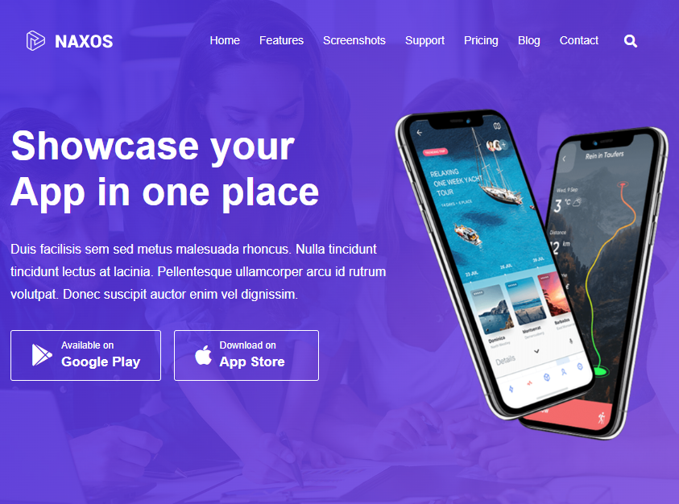

# GoTrip

Данный проект представляет собой одностраничный сайт (лендинг), написанный самостоятельно по готовому сайту (ссылка есть в самом лендинге). При этом разработка шла таким же образом, как бы это было по макету в **Figma** или аналогичных программах.

  
   
  <em>Рисунок 1 - первый блок на странице</em>

В проекте использовались следующие технологии

1) Верстка на **HTML**, **SCSS**, **JS** (немного)
2) Популярная библиотека **Swiper** для прокрутки карточек товара

## Как можно посмотреть лендинг
Данный сайт никуда не размещен, поэтому можно посмотреть, склонировав репозиторий. Для просмотра рекомендуется использовать плагин **Live Server**
в **Visual Studio Code**, т.к. присутствует фейковый запрос, который не может обрабатываться без запуска сервера, в том числе локального. 
Эту проблему и решает плагин в **VSCode**.

## Информация
Некоторая информация, которую проще по пунктам расписать:
1) Сайт - учебный, одностраничный, прежде всего использовался для обучения верстке
2) Адаптирован под мобильные устройства (с помощью media-запросов), desktop-first (*swiper* - mobile-first)
3) Написан в марте 2024 года, кое-что дописано перед публикацией.
